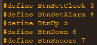
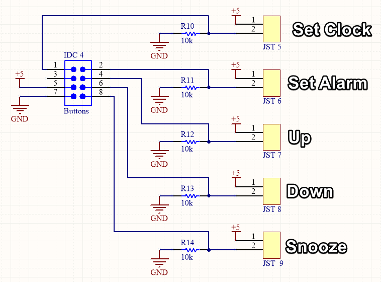
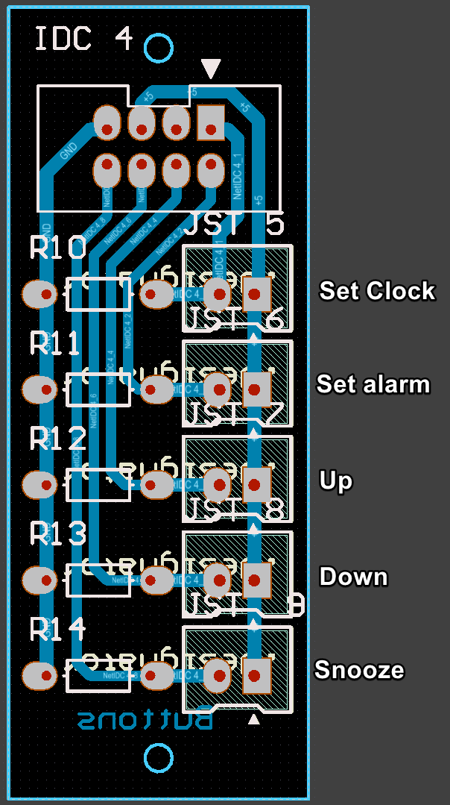
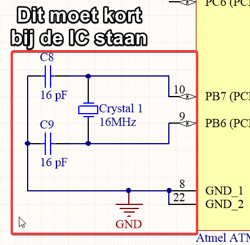

# Arduino-clock-V2

### Links naar de circuit schematics
* https://workspace.circuitmaker.com/Projects/Details/pieter-partous/WekkerGROEP3PIETER-Display-PCB
* https://workspace.circuitmaker.com/Projects/Details/pieter-partous/WekkerGROEP3PIETER-Buttons-PCB
* https://workspace.circuitmaker.com/Projects/Details/pieter-partous/WekkerGROEP3PIETER-Main-board-PCB-V2

### Knoppen

### Extra
